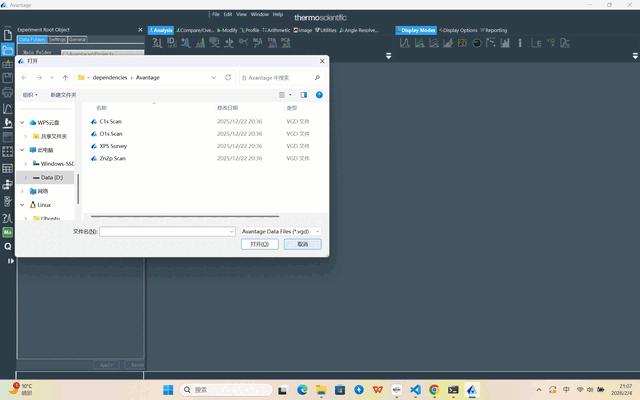
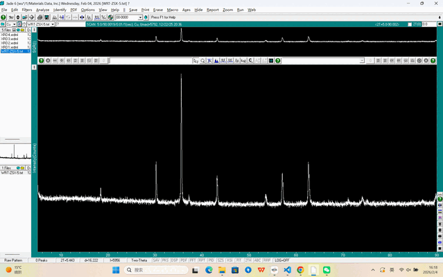
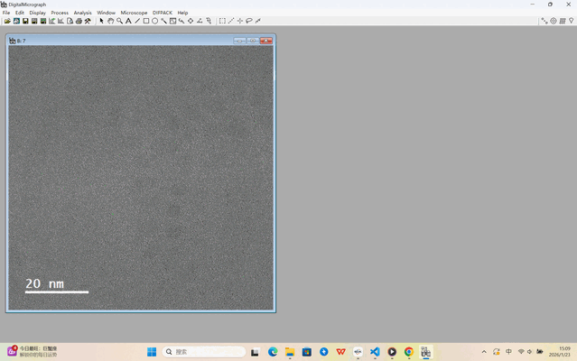
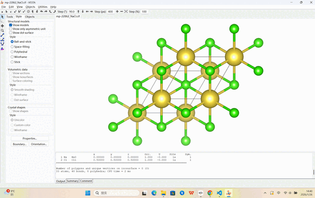

<div align="center">


<h1><span style="color:#2060a8">Mat</span><span style="color:#2e8b48">Tool</span><span style="color:#d07810">Bench</span></h1>

[](https://opensource.org/licenses/MIT)
[](https://www.python.org/)
[](https://hub.docker.com/r/mattoolbench/mattoolbench)
[](https://meiwu5.github.io/MatToolBench/)

</div>

**MatToolBench** 是一个面向材料科学的桌面 AI 智能体评测基准。它在真实的 Windows 11 虚拟机环境中，对 AI 智能体在专业材料表征软件、计算数据库和脚本数据分析等端到端任务上的能力进行评估，涵盖三类任务——**Origin**（脚本数据分析）、**GUI**（材料软件视觉交互）、**Code**（数据库程序化查询）。

---

## 🎬 演示视频

<video controls src="docs/demo.mp4" style="width:100%;max-width:900px;border-radius:8px"></video>

> **<span style="color:#d07810">⚡ 视频已加速</span>** &nbsp;·&nbsp; 若视频无法内嵌播放，可[直接下载](docs/demo.mp4)。

## 🔬 智能体操作轨迹

真实智能体运行的逐步截图，以 20 倍速播放，每帧对应一次智能体操作。

<table>
<tr>
<td align="center"><b>Avantage（XPS）</b><br></td>
<td align="center"><b>JADE（XRD）</b><br></td>
</tr>
<tr>
<td align="center"><b>Digital Micrograph</b><br></td>
<td align="center"><b>Materials Studio</b><br></td>
</tr>
<tr>
<td align="center" colspan="2"><b>VESTA</b><br></td>
</tr>
</table>

---

## 📊 主要结果

各模型精度汇总。**Sc.** = 任务归一化得分（0–100）；**SR** = 成功率（%，所有子标准均满足的任务比例）。<b style="color:#c96800">橙色加粗</b>：该领域最佳；<u>下划线</u>：次优；<b style="color:#c0392b"><i>红色粗斜体</i></b>：总体最佳模型。完整的逐领域结果请查看[网站榜单](https://meiwu5.github.io/MatToolBench/#leaderboard)。

<table>
<thead>
<tr>
<th rowspan="2"><b>类别</b></th>
<th rowspan="2"><b>领域</b></th>
<th colspan="2" align="center">Doubao<br>seed-1-8</th>
<th colspan="2" align="center">Kimi<br>k2.5</th>
<th colspan="2" align="center">Claude<br>sonnet-4.6</th>
<th colspan="2" align="center"><b style="color:#c0392b"><i>GPT<br>5.4</i></b></th>
<th colspan="2" align="center">Qwen3-VL<br>235B</th>
<th colspan="2" align="center">Qwen3-VL<br>32B</th>
<th colspan="2" align="center">Qwen3-VL<br>8B</th>
</tr>
<tr>
<th>Sc.</th><th>SR</th><th>Sc.</th><th>SR</th><th>Sc.</th><th>SR</th>
<th>Sc.</th><th>SR</th><th>Sc.</th><th>SR</th><th>Sc.</th><th>SR</th><th>Sc.</th><th>SR</th>
</tr>
</thead>
<tbody>
<tr>
<td rowspan="6"><b>GUI</b></td>
<td>Avantage</td>
<td><b style="color:#c96800">44.6</b></td><td><b style="color:#c96800">35.0</b></td>
<td>32.3</td><td><u>20.0</u></td>
<td><u>41.3</u></td><td><b style="color:#c96800">35.0</b></td>
<td>32.3</td><td>15.0</td>
<td>30.8</td><td>10.0</td>
<td>26.2</td><td>15.0</td>
<td>18.5</td><td>15.0</td>
</tr>
<tr>
<td>JADE</td>
<td><u>54.2</u></td><td><b style="color:#c96800">25.0</b></td>
<td>50.8</td><td><b style="color:#c96800">25.0</b></td>
<td><b style="color:#c96800">57.6</b></td><td><b style="color:#c96800">25.0</b></td>
<td>50.8</td><td><u>20.0</u></td>
<td>45.8</td><td>10.0</td>
<td>37.3</td><td>10.0</td>
<td>37.3</td><td>5.0</td>
</tr>
<tr>
<td>DM</td>
<td><b style="color:#c96800">56.7</b></td><td><b style="color:#c96800">20.0</b></td>
<td><u>52.2</u></td><td><b style="color:#c96800">20.0</b></td>
<td>40.3</td><td><b style="color:#c96800">20.0</b></td>
<td>50.7</td><td><b style="color:#c96800">20.0</b></td>
<td><u>52.2</u></td><td><u>10.0</u></td>
<td>6.0</td><td>0.0</td>
<td>38.8</td><td><u>10.0</u></td>
</tr>
<tr>
<td>MS</td>
<td>47.6</td><td>15.0</td>
<td>35.4</td><td>10.0</td>
<td><u>52.4</u></td><td><u>20.0</u></td>
<td><b style="color:#c96800">56.1</b></td><td><b style="color:#c96800">30.0</b></td>
<td>43.9</td><td>0.0</td>
<td>26.8</td><td>0.0</td>
<td>20.7</td><td>0.0</td>
</tr>
<tr>
<td>VESTA</td>
<td>52.2</td><td><u>20.0</u></td>
<td><u>59.4</u></td><td><b style="color:#c96800">25.0</b></td>
<td>58.0</td><td><b style="color:#c96800">25.0</b></td>
<td><b style="color:#c96800">65.2</b></td><td><u>20.0</u></td>
<td>52.2</td><td>10.0</td>
<td>29.0</td><td>10.0</td>
<td>30.4</td><td>10.0</td>
</tr>
<tr>
<td><i>均值</i></td>
<td><b style="color:#c96800">52.1</b></td><td><u>24.0</u></td>
<td>46.0</td><td>20.0</td>
<td>49.9</td><td><b style="color:#c96800">25.0</b></td>
<td><u>51.0</u></td><td>21.0</td>
<td>45.0</td><td>8.0</td>
<td>25.1</td><td>7.0</td>
<td>29.1</td><td>8.0</td>
</tr>
<tr>
<td><b>Origin</b></td>
<td>OriginPro</td>
<td>11.7</td><td>12.5</td>
<td>22.5</td><td>25.0</td>
<td><u>53.1</u></td><td><u>56.3</u></td>
<td><b style="color:#c96800">63.8</b></td><td><b style="color:#c96800">68.8</b></td>
<td>6.3</td><td>6.3</td>
<td>5.3</td><td>6.3</td>
<td>0.0</td><td>0.0</td>
</tr>
<tr>
<td rowspan="5"><b>Code</b></td>
<td>Pymatgen</td>
<td>30.0</td><td>30.0</td>
<td>15.0</td><td>15.0</td>
<td>25.0</td><td>25.0</td>
<td><b style="color:#c96800">35.0</b></td><td><b style="color:#c96800">35.0</b></td>
<td><b style="color:#c96800">35.0</b></td><td><b style="color:#c96800">35.0</b></td>
<td><u>29.4</u></td><td><u>29.4</u></td>
<td>15.0</td><td>15.0</td>
</tr>
<tr>
<td>MP</td>
<td><b style="color:#c96800">25.0</b></td><td><b style="color:#c96800">25.0</b></td>
<td><u>22.5</u></td><td><u>20.0</u></td>
<td>21.9</td><td>15.0</td>
<td>17.5</td><td>15.0</td>
<td><b style="color:#c96800">25.0</b></td><td><b style="color:#c96800">25.0</b></td>
<td>10.0</td><td>10.0</td>
<td>10.0</td><td>10.0</td>
</tr>
<tr>
<td>OQMD</td>
<td>33.2</td><td>10.0</td>
<td>50.3</td><td>30.0</td>
<td><b style="color:#c96800">60.8</b></td><td><b style="color:#c96800">50.0</b></td>
<td><u>58.2</u></td><td><u>45.0</u></td>
<td>26.2</td><td>10.0</td>
<td>11.5</td><td>0.0</td>
<td>18.4</td><td>0.0</td>
</tr>
<tr>
<td>OPTIMADE</td>
<td>70.0</td><td>70.0</td>
<td><u>80.0</u></td><td><u>80.0</u></td>
<td>75.0</td><td>75.0</td>
<td><b style="color:#c96800">85.0</b></td><td><b style="color:#c96800">85.0</b></td>
<td>20.0</td><td>20.0</td>
<td>30.0</td><td>30.0</td>
<td>10.0</td><td>10.0</td>
</tr>
<tr>
<td><i>均值</i></td>
<td>39.6</td><td>33.8</td>
<td>42.0</td><td>36.2</td>
<td><u>45.7</u></td><td><u>41.3</u></td>
<td><b style="color:#c96800">48.9</b></td><td><b style="color:#c96800">45.0</b></td>
<td>26.6</td><td>22.5</td>
<td>20.2</td><td>17.4</td>
<td>13.4</td><td>8.8</td>
</tr>
<tr>
<td colspan="2"><b>总体均值</b></td>
<td>42.5</td><td>26.3</td>
<td>42.0</td><td>27.0</td>
<td><u>48.5</u></td><td><u>34.6</u></td>
<td><b style="color:#c0392b"><i>51.5</i></b></td><td><b style="color:#c0392b"><i>35.4</i></b></td>
<td>33.7</td><td>13.6</td>
<td>21.2</td><td>11.1</td>
<td>19.9</td><td>7.5</td>
</tr>
</tbody>
</table>

---

## 📚 任务类别

| 类别 | 领域 | 任务数量 | 智能体类型 | 说明 |
|------|------|----------|------------|------|
| **Origin** | XRD、XPS、Raman、Cycle、Step、CE | ~96 | OriginAgent | 编写 OriginPro 脚本分析实验数据并生成图表 |
| **GUI** | Jade、Avantage、VESTA、DM、MS | ~65 | GUIAgent | 视觉交互，操作材料软件 GUI 完成分析任务 |
| **Code** | MP、OQMD、PyMatgen、OPTIMADE | ~92 | CodeAgent | 生成 Python 代码查询材料数据库，获取材料属性 |

---

## 🗺️ 系统总览

```
┌─────────────────────────────────────────────────────────────┐
│                       输入（任务配置）                        │
│              experiment_configs/*.json                       │
│         { task_id, agent_type, model, ... }                 │
└───────────────────────┬─────────────────────────────────────┘
                        │
          ┌─────────────┴─────────────┐
          │                           │
    run-local.sh                 run_azure.py
          │                           │
    本地 Docker 容器            Azure ML Job
    （单机运行）               （多 VM 并行）
          │                           │
          └─────────────┬─────────────┘
                        │
                     run.py
                        │
          ┌─────────────┼─────────────┐
          │             │             │
     GUI Agent    Origin Agent   Code Agent
          │             │             │
    截图 → 规划      LLM 编写        LLM 编写
    → 鼠标/键盘      .py 脚本        查询代码
          │             │             │
   Windows VM      OriginPro      数据库 API
  （QEMU/Docker）  （VM 内）       （HTTP 请求）
   Jade / VESTA /
   Avantage / DM /
   Materials Studio
          │             │             │
          └─────────────┴─────────────┘
                        │
                   evaluators/
               （getters + metrics）
                        │
┌─────────────────────────────────────────────────────────────┐
│                          输出                                │
│    output_result/  +  results/logs/  +  截图轨迹             │
└─────────────────────────────────────────────────────────────┘
```

**本地与 Azure 对比：**

| | 本地 | Azure |
|---|---|---|
| 入口 | `scripts/run-local.sh` | `scripts/run_azure.py` |
| 存储 | 本地磁盘（`vm/storage/`）| Azure Blob Storage |
| 并发 | 单机串行 | 多 Job 并行（`num_workers`）|
| Docker 镜像 | 本地构建 `mattoolbench:latest` | 拉取 `mattoolbench/mattoolbench:latest` |
| VM 镜像 | 持久化于 `vm/storage/` | 上传至 Azure datastore |

---

## 🗂️ 项目结构

```
MatToolBench/
├── config.json                        # API Key、Azure 凭证
├── requirements.txt                   # 宿主机依赖（azure-ai-ml 等）
│
├── scripts/
│   ├── build-container-image.sh       # Docker 镜像构建入口
│   ├── run-local.sh                   # 本地运行脚本
│   ├── run_azure.py                   # Azure ML 运行脚本（全云模式）
│   ├── run_local_agent.py             # 本地智能体对接 Azure 云端虚拟机
│   ├── show_azure.py                  # 汇总 Azure 运行结果
│   ├── sync_results.py                # 增量同步 Azure 结果到本地文件夹
│   ├── compute_efficiency.py          # 从 eval_detail.json 计算效率指标
│   ├── experiments.json               # Azure 实验配置
│   └── azure_files/                   # Azure 启动脚本
│       ├── run_entry.py               # 每台 Azure VM 上的 Job 入口
│       └── compute-instance-startup.sh
│
└── src/mattoolbench-container/
    ├── Dockerfile-MatToolBench-Base   # 镜像层1：Python / CUDA / 模型权重
    ├── Dockerfile-MatToolBench        # 镜像层2：客户端代码 + VM 文件
    ├── entry.sh / start_vm.sh / start_client.sh
    │
    ├── vm/
    │   ├── image/setup.iso            # Windows 11 安装镜像
    │   ├── storage/                   # VM 磁盘快照（windows.base 等）
    │   ├── unattend-files/            # 自动安装应答文件
    │   └── setup/                     # Windows 内部安装脚本 + 工具包
    │       └── [Avantage / VESTA / DigitalMicrograph / Materials Studio / ...]
    │
    └── client/                        # Python 客户端（运行于容器内）
        ├── run.py                     # 主执行入口
        ├── experiment_configs/        # 各实验的 JSON 配置文件
        │   ├── main_gpt_5.json
        │   ├── main_claude_sonnet_4_6.json
        │   ├── main_gemini_1.5_pro.json
        │   ├── ablation_gui_som_*.json
        │   └── ...
        ├── desktop_env/
        │   ├── envs/desktop_env.py    # 核心环境类
        │   ├── controllers/           # VM / Python / 安装控制器
        │   └── evaluators/
        │       ├── getters/           # 各软件状态读取（jade、vesta 等）
        │       └── metrics/           # 评分函数
        ├── mm_agents/
        │   ├── gui_agent.py           # GUI 智能体
        │   ├── origin_agent.py        # Origin 智能体
        │   ├── code_agent.py          # Code 智能体
        │   └── navi/                  # NaviAgent 框架
        │       ├── screenparsing_oss/ # GroundingDINO、OmniParser、OCR
        │       ├── gpt/               # GPT-4V / Phi-3 视觉规划器
        │       └── llm/               # 纯文本 LLM 规划器
        ├── task_code/                 # 各数据库任务参考代码（MP、OQMD 等）
        ├── evaluation_examples_windows/  # 任务定义（JSON）
        └── output_result/             # 实验输出结果
```

---

## 🚀 快速开始（WSL / Linux）

最快的本地运行方式——无需构建镜像。

### 前置准备

- 已安装并运行 [Docker](https://docs.docker.com/desktop/wsl/)（Windows 用户推荐使用 WSL 2）
- [OpenAI](https://platform.openai.com/docs/introduction) 或 [Azure OpenAI](https://azure.microsoft.com/en-us/products/ai-services/openai-service) API Key
- Python 3.12（推荐使用 [Conda](https://docs.conda.io/projects/conda/en/latest/user-guide/getting-started.html)）

克隆仓库并安装宿主机依赖：
```bash
git clone https://github.com/meiwu5/MatToolBench.git
cd MatToolBench
conda create -n mattoolbench python=3.12
conda activate mattoolbench
pip install -r requirements.txt
```

### 第一步 — 拉取 Docker 镜像

```bash
docker pull mattoolbench/mattoolbench:latest
```

> 镜像约 27 GB，包含完整 Python 环境、模型权重（GroundingDINO、OmniParser）及评测客户端。

### 第二步 — 下载 VM 快照

从 Google Drive 下载预构建的 Windows 11 VM 快照（已预装所有材料科学软件），解压后放入：

**[从 Google Drive 下载 VM 快照](https://drive.google.com/drive/folders/1JEquB482BRsghgyJbWcwEBdZSXL_97e9?usp=drive_link)**

```
src/mattoolbench-container/vm/storage/
├── windows.base
├── windows.boot
├── windows.mac
├── windows.rom
├── windows.vars
├── windows.ver
└── data.img
```

### 第三步 — 配置 API Key

在项目根目录创建 `config.json`：
```json
{
    "OPENAI_API_KEY": "<your-openai-key>",
    "OPENAI_ENDPOINT": "https://api.openai.com/v1",
    "MP_API_KEY": "<your-materials-project-api-key>"
}
```

### 第四步 — 运行

```bash
cd scripts
./run-local.sh
```

在浏览器打开 **http://localhost:8006** 即可实时观察 Windows 11 虚拟机启动和智能体执行任务的过程。

---

## 💻 本地部署（WSL 或 Linux）

### 1. 配置

在项目根目录创建 `config.json`：
```json
{
    "OPENAI_API_KEY": "<your-openai-key>",
    "OPENAI_ENDPOINT": "https://api.openai.com/v1",
    "AZURE_API_KEY": "<your-azure-openai-key>",
    "AZURE_ENDPOINT": "https://yourendpoint.openai.azure.com/",

    "MP_API_KEY": "<your-materials-project-api-key>"
}
```

> OpenAI 和 Azure OpenAI 二选一即可，脚本会自动检测。两者均未填写时会报错退出。

> **`MP_API_KEY`** 是运行 **Code 类任务**中 [Materials Project](https://materialsproject.org) 数据库查询（`mp` 和 `optimade` 领域）的必填项。请前往 [materialsproject.org/dashboard](https://materialsproject.org/dashboard) 获取 API Key。未填写时，相关任务会报认证错误。`OQMD` 和 `pymatgen` 任务无需此 Key。

### 2. Docker 镜像

#### 方式 A — 从 Docker Hub 拉取（推荐）

```bash
docker pull mattoolbench/mattoolbench:latest
```

两个镜像均已发布至 Docker Hub：

| 镜像 | 大小 | 说明 |
|------|------|------|
| `mattoolbench/mattoolbench:latest` | ~27 GB | 完整可运行镜像 |
| `mattoolbench/mattoolbench-base:latest` | ~21 GB | 基础层（用于自定义构建）|

#### 方式 B — 本地构建

```bash
cd scripts
./build-container-image.sh --build-base-image true
```

> Base 镜像阶段会安装 Python 依赖、CUDA 库并下载模型权重，耗时约 **30–60 分钟**。

base 镜像已构建且未变更时：
```bash
./build-container-image.sh   # --build-base-image 默认为 false
```

### 3. 准备 Windows 11 虚拟机

#### 3.1 下载 Windows 11 ISO

前往 [Microsoft Evaluation Center](https://info.microsoft.com/ww-landing-windows-11-enterprise.html)，下载 **Windows 11 Enterprise Evaluation（90 天试用版，英文，美国）**（约 6 GB），将文件重命名为 `setup.iso`，放至：
```
src/mattoolbench-container/vm/image/setup.iso
```

#### 3.2 构建黄金镜像

有两种方式获取黄金镜像，推荐直接下载我们预构建的 VM 快照。

---

##### 方式 A：使用预构建 VM 快照（推荐）

直接下载我们已配置好的 VM 快照，所有材料科学软件均已安装完毕，无需手动操作。

**下载地址：** [MatToolBench VM Snapshot](https://drive.google.com/drive/folders/1JEquB482BRsghgyJbWcwEBdZSXL_97e9?usp=drive_link)

解压后将文件放至：
```
src/mattoolbench-container/vm/storage/
├── windows.base
├── windows.boot
├── windows.mac
├── windows.rom
├── windows.vars
├── windows.ver
└── data.img
```

完成后直接跳至 [§ 4 运行基准测试](#4-运行基准测试)。

---

##### 方式 B：从头构建

自动脚本负责 Windows 11 的安装，专业材料科学软件需通过共享文件夹手动安装。

**B-1 — 下载软件安装包**

将各软件安装包下载后，放入 `src/mattoolbench-container/vm/setup/` 下对应的子目录：

| 软件 | 用途 | 版本 | 安装包路径 | 下载 |
|------|------|------|-----------|------|
| **OriginPro** | 数据分析与绘图 | 2024 | `vm/setup/OriginSetup.exe` | [下载](TODO) |
| **Jade** | XRD 物相分析 | 9.0 | `vm/setup/Jade_setup.exe` | [下载](TODO) |
| **Avantage** | XPS 分析 | 6.6.0 | `vm/setup/Avantage 6.6.0/Setup.exe` | [下载](TODO) |
| **VESTA** | 晶体结构可视化 | 3.90.1 | `vm/setup/VESTA-win64/` | [下载](https://jp-minerals.org/vesta/en/download.html) |
| **Digital Micrograph (GMS)** | TEM/EELS 分析 | 3.5 | `vm/setup/DigitalMicrograph/setup.exe` | [下载](TODO) |
| **Materials Studio** | 分子模拟 | 2023 (64位) | `vm/setup/Materials Studio 2023(64bit)/` | [下载](TODO) |

> VESTA 为开源软件，可从官网直接下载。其余均为商业软件，请联系相应厂商或通过机构授权获取。

自动化配置脚本还会在 Windows 内安装 VM 服务端 Python 环境（`vm/setup/server/requirements.txt`，用于截图采集、动作执行和无障碍树查询），以及 Code 任务所需的各领域 Python 虚拟环境（mp/oqmd/pymatgen/optimade，位于 `C:\Users\Docker\`）。这些环境由 PowerShell 脚本自动配置，无需手动安装。

**B-2 — 启动 Windows 11 自动安装**

```bash
cd scripts
./run-local.sh --mode dev --prepare-image true
```

在浏览器打开 `http://localhost:8006` 可观察 VM 启动和自动配置过程（Windows 安装 + 基础工具配置约需 **20 分钟**）。

**B-3 — 在 VM 内手动安装材料科学软件**

自动配置完成、Windows 桌面出现在 `http://localhost:8006` 后：

1. 在 VM 内打开**文件资源管理器**，导航到 `\\host.lan\Data`——这是宿主机 `src/mattoolbench-container/vm/setup/` 目录的共享映射。
2. 按以下顺序依次运行安装包：

```
\\host.lan\Data\OriginSetup.exe                        → 按向导完成安装
\\host.lan\Data\Jade_setup.exe                         → 按向导完成安装
\\host.lan\Data\Avantage 6.6.0\Setup.exe               → 按向导完成安装
\\host.lan\Data\VESTA-win64\VESTA_Setup.exe             → 按向导完成安装
\\host.lan\Data\DigitalMicrograph\setup.exe             → 按向导完成安装
\\host.lan\Data\Materials Studio 2023(64bit)\Setup.exe  → 按向导完成安装
```

3. 所有软件安装完成后，在 Windows 内正常关机（开始菜单 → 关机）。`vm/storage/` 中的磁盘快照会自动更新。


#### 3.3 保存与复用 VM 快照

方式 B 构建完成后，备份整个 `vm/storage/` 目录，下次使用时无需重新安装：

```
vm/storage/
├── windows.base     ← VM 主磁盘镜像
├── windows.boot
├── windows.mac
├── windows.rom
├── windows.vars
├── windows.ver
└── data.img
```

将该目录复制到安全位置保存。需要恢复时，在运行 `./run-local.sh` 前将其放回原路径即可。

### 4. 运行基准测试

#### 4.1 快速启动
```bash
cd scripts
./run-local.sh
```

#### 4.2 使用实验配置文件

所有实验参数以 JSON 文件定义在 `experiment_configs/` 目录下：

```bash
cd src/mattoolbench-container/client
python run.py --config experiment_configs/main_gpt_5.json

# 运行时覆盖单个参数：
python run.py --config experiment_configs/main_gpt_5.json --trial_id 1
```

可用主实验配置：

| 配置文件 | 模型 |
|---|---|
| `main_gpt_5.json` | GPT-5（OpenAI）|
| `main_gpt_5_mini.json` | GPT-5-mini |
| `main_claude_sonnet_4_6.json` | Claude Sonnet 4.6 |
| `main_gemini_1.5_pro.json` | Gemini 1.5 Pro |
| `main_qwen_max.json` | Qwen-Max |

#### 4.3 调试 / 交互模式

以交互模式启动容器（不自动启动 VM 和客户端）：
```bash
./run-local.sh --interactive true
# 进入容器后手动启动各进程：
./start_vm.sh
./start_client.sh
```

测试 Windows VM 是否可访问：
```bash
./run-local.sh --connect true
# 在容器内执行：
curl -X GET http://20.20.20.21:5000/screenshot  # 返回 HTTP 200 则正常
```

#### 4.4 查看结果
```bash
cd src/mattoolbench-container/client
python show_result.py --result_dir results/main_gpt_5
python print_ablation_results.py   # 打印所有消融实验对比表格
```

日志位置：
- PowerShell 安装日志：`vm/setup/ps_script_log.txt`
- Windows 服务端日志：`vm/setup/server/server.log`

---

## ☁️ Azure 云端部署

Azure 部署通过 Azure ML Compute Instance 在多台云服务器上并行运行实验——每台服务器独立运行一个 Windows 11 虚拟机，所有 Worker 同时工作，大幅提升评测吞吐量。

### 部署架构

```
本地机器
  └── run_azure.py
        │
        ├── 并行创建 N 个 Compute Instance
        │     w0<exp>、w1<exp>、...、w{N-1}<exp>
        │
        └── 并行提交 N 个 ML Job
              每个 Job 在各自的 Compute Instance 上：
                ├── 拉取 Docker 镜像
                ├── 从 Azure Blob 复制 VM 快照
                ├── 启动 Windows 11 虚拟机（QEMU）
                └── 运行 Python 智能体（run.py）
```

---

### 第一步 — Azure 环境准备

需要具备：
- 拥有足够配额的 **Azure 订阅**（例如 `Standard_D8_V3` 每个 Worker 需要 8 个 vCPU 核心）
- 一个 **Azure ML 工作区**（在 [ml.azure.com](https://ml.azure.com) 创建）
- 工作区中注册的 **Azure Blob Storage 数据存储**（默认使用 `workspaceblobstore`）
- 已登录 **Azure CLI**，或配置好 `DefaultAzureCredential` 所需的凭证

如需申请配额提升：
> Azure ML 门户 → 工作区 → 计算 → 配额 → 申请提升

---

### 第二步 — 在 `config.json` 中添加 Azure 凭证

在项目根目录的 `config.json` 中追加 Azure ML 相关凭证：

```json
{
    "OPENAI_API_KEY": "<your-openai-key>",
    "OPENAI_ENDPOINT": "https://api.openai.com/v1",
    "AZURE_API_KEY": "<your-azure-openai-key>",
    "AZURE_ENDPOINT": "https://yourendpoint.openai.azure.com/",

    "MP_API_KEY": "<your-materials-project-api-key>",

    "AZURE_SUBSCRIPTION_ID": "<your-subscription-id>",
    "AZURE_ML_RESOURCE_GROUP": "<your-resource-group>",
    "AZURE_ML_WORKSPACE_NAME": "<your-workspace-name>",

    "AZURE_STORAGE_ACCOUNT": "<your-storage-account-name>",
    "AZURE_STORAGE_KEY": "<your-storage-account-key>",
    "AZURE_STORAGE_CONTAINER": "<your-blob-container-name>"
}
```

| 字段 | 是否必填 | 说明 |
|------|----------|------|
| `OPENAI_API_KEY` + `OPENAI_ENDPOINT` | LLM 二选一 | OpenAI 兼容的 API Key 和 Base URL |
| `AZURE_API_KEY` + `AZURE_ENDPOINT` | LLM 二选一 | Azure OpenAI Key 和端点 |
| `MP_API_KEY` | `mp` / `optimade` Code 任务必填 | [Materials Project](https://materialsproject.org/dashboard) API Key。CodeAgent 运行时会将其注入生成的脚本中。`oqmd` 和 `pymatgen` 任务无需此 Key。 |
| `AZURE_SUBSCRIPTION_ID` / `AZURE_ML_RESOURCE_GROUP` / `AZURE_ML_WORKSPACE_NAME` | Azure 云端模式必填 | Azure ML 工作区标识信息 |
| `AZURE_STORAGE_ACCOUNT` / `AZURE_STORAGE_KEY` / `AZURE_STORAGE_CONTAINER` | Azure 云端模式 | `clear_agent_outputs.py` 所需的存储账号凭证 |

---

### 第三步 — 上传 VM 快照至 Azure Blob

Windows 11 黄金镜像必须提前上传到 Azure Blob Storage，各 Worker 启动时会从此处下载。

1. 先在本地构建黄金镜像（参见[本地部署 § 3.2](#32-构建黄金镜像)），或使用已有快照。
2. 将整个 `vm/storage/` 目录上传至 Azure 数据存储：

```bash
# 使用 Azure CLI 批量上传
az storage blob upload-batch \
    --account-name <your-storage-account> \
    --destination <your-blob-container>/storage \
    --source src/mattoolbench-container/vm/storage/ \
    --account-key "<your-account-key>"
```

也可使用 [Azure Storage Explorer](https://azure.microsoft.com/en-us/products/storage/storage-explorer) 将 `vm/storage/` 文件夹拖拽上传至对应 Blob 容器中的 `storage` 路径（与 `experiments.json` 中 `datastore_input_path` 对应）。

上传后 Blob 中的预期目录结构：
```
storage/
├── windows.base
├── windows.boot
├── windows.mac
├── windows.rom
├── windows.vars
├── windows.ver
└── data.img
```

---

### 第四步 — 上传 Compute Instance 启动脚本

每台 Azure Compute Instance 创建时会执行一个启动脚本，需提前上传至 ML 工作区的文件存储：

```bash
azcopy copy scripts/azure_files/compute-instance-startup.sh \
    "https://<storage>.blob.core.windows.net/azureml/Users/<username>/compute-instance-startup.sh"
```

然后在 `experiments.json` 中将 `ci_startup_script_path` 更新为对应的 `Users/` 路径：
```json
"ci_startup_script_path": "Users/<your-username>/compute-instance-startup.sh"
```

---

### 第五步 — 配置 `scripts/experiments.json`

```json
{
  "experiment_1": {
    "ci_startup_script_path": "Users/<your-username>/compute-instance-startup.sh",
    "docker_img_name":        "mattoolbench/mattoolbench:latest",
    "datastore_input_path":   "storage",
    "exp_name":               "Experiment1",
    "vm_size":                "Standard_D8_V3",
    "num_workers":            10,
    "agent":                  "auto",
    "model_name":             "gpt-5",
    "som_origin":             "oss",
    "a11y_backend":           "uia",
    "origin_mode":            "script",
    "json_name":              "evaluation_examples_windows/test_all.json",
    "max_steps":              50,
    "max_tokens":             2048,
    "origin_max_tokens":      8000,
  }
}
```

**参数说明：**

| 参数 | 说明 | 默认值 |
|------|------|--------|
| `ci_startup_script_path` | 启动脚本在 ML 工作区文件存储中的路径 | — |
| `docker_img_name` | 各 VM 拉取的 Docker Hub 镜像 | `mattoolbench/mattoolbench:latest` |
| `datastore_input_path` | Azure Blob 中 VM 快照的路径 | `storage` |
| `exp_name` | 实验名称，同时作为 Azure ML Experiment 名称 | — |
| `vm_size` | 每台 Compute Instance 的 Azure VM 规格 | `Standard_D8_V3` |
| `num_workers` | 并行 Compute Instance（Worker）数量 | `1` |
| `agent` | 智能体路由（`auto`、`gui`、`code`、`origin`、`navi`）| `auto` |
| `model_name` | LLM 骨干模型（如 `gpt-5`、`claude-sonnet-4-6`）| — |
| `som_origin` | 屏幕解析方式（`oss`、`a11y`、`mixed-oss`、`omni`）| `oss` |
| `a11y_backend` | 无障碍后端（`uia`、`win32`）| `uia` |
| `origin_mode` | 模板脚本注入（`script`、`no_script`）| `script` |
| `json_name` | 容器内的任务列表 JSON | `evaluation_examples_windows/test_all.json` |
| `use_managed_identity` | 使用 Azure 托管身份代替服务主体 | `false` |

---

### 第六步 — 启动实验

**全云模式**（智能体在 Azure 运行，全程自动化）：

```bash
cd scripts
python run_azure.py --experiments_json experiments.json
```

`run_azure.py` 执行流程：
1. **并行**创建（或启动）`N` 台 Compute Instance，命名规则为 `w0<exp_name>`、`w1<exp_name>`……
2. **并行**提交 `N` 个 ML Job——每个 Job 自动下载 VM 快照、启动 Windows 虚拟机、运行智能体。

在 [Azure ML Studio](https://ml.azure.com) 中可实时查看任务状态；也可通过以下命令汇总结果：

```bash
python show_azure.py \
    --result_dir <your-result-dir> \
    --json_config experiments.json \
    --output_file results_table.md
```

---

### 第七步 — 收集结果

结果写入 `workspaceblobstore` 中的 `agent_outputs/` 路径（Azure Blob 输出数据集）。

#### 方式 A：实时同步（推荐）

`scripts/sync_results.py` 持续将 Azure Blob 上的新增或更新文件拉取到本地文件夹，支持增量同步（仅下载有变化的文件）：

```bash
# 安装依赖（如尚未安装）
pip install azure-storage-blob

# 持续同步，每 30 秒一次（默认）
python scripts/sync_results.py --local_dir ./results_local

# 自定义同步间隔（秒）
python scripts/sync_results.py --local_dir ./results_local --interval 60

# 仅同步一次后退出
python scripts/sync_results.py --local_dir ./results_local --once

# 只同步指定实验
python scripts/sync_results.py --local_dir ./results_local --exp_name Experiment1
```

汇总结果：
```bash
python scripts/show_azure.py \
    --result_dir ./results_local \
    --json_config scripts/experiments.json \
    --output_file results_table.md
```

#### 方式 B：通过 Azure CLI 一次性下载

```bash
az storage blob download-batch \
    --account-name <your-storage-account> \
    --source <your-blob-container>/agent_outputs/<exp_name> \
    --destination ./results/ \
    --account-key "<your-account-key>"
```

---

## 🤖 智能体详情

### 智能体路由

`--agent` 参数（或 `experiments.json` 中的 `agent` 字段）控制每个任务使用哪类智能体。默认 `auto` 模式根据任务领域自动选择。

| 值 | 智能体类 | 适用领域 |
|---|---|---|
| `auto` *（默认）* | 按领域自动路由 | 全部 |
| `gui` | `GUIAgent` | avantage、dm、jade、vesta、ms |
| `code` | `CodeAgent` | mp、oqmd、pymatgen、optimade |
| `origin` | `OriginAgent` | origin |

### 观测模型

所有 GUI 和 Origin 任务的默认观测方式是**原始截图**（`observation_type=screenshot`，`som_origin=no_omni`）：截图直接传给 LLM，不叠加任何 Set-of-Marks（SoM）元素标注框。这是主基准评测所使用的配置。

消融实验提供六种观测模式：

| `som_origin` | `observation_type` | 说明 |
|---|---|---|
| `no_omni` *（主评测）* | `screenshot` | 原始截图，无元素标注 |
| `oss` | `screenshot` | 截图 + OCR 文本区域叠加 |
| `omni` | `screenshot` | 截图 + OmniParser 元素框（YOLO + Florence）|
| `a11y` | `a11y_tree` | 仅 Windows 无障碍树（无截图）|
| `mixed-oss` | `a11y_tree` | 无障碍树 + OCR 融合 |
| `mixed-omni` | `a11y_tree` | 无障碍树 + OmniParser 融合 |

> 需要 `a11y_tree` 的模式会触发 Windows UIA API 调用，每步可能耗时 5–60 秒。除非 `som_origin` 确实需要无障碍树，请勿设置 `observation_type=a11y_tree`。

### 动作空间

所有智能体生成 Python 代码字符串，通过 HTTP 发送至 VM 服务端并用 `exec()` 执行。VM 服务端暴露一个 `Computer` 对象，包含五个子模块：

| 模块 | 方法示例 |
|---|---|
| `computer.mouse` | `move(x, y)`、`click(x, y)`、`double_click(x, y)`、`scroll(x, y, dx, dy)` |
| `computer.keyboard` | `type(text)`、`hotkey(*keys)`、`key_down(key)`、`key_up(key)` |
| `computer.clipboard` | `get_text()`、`set_text(text)` |
| `computer.os` | `run(cmd)`、`get_pid(name)` |
| `computer.window` | `activate(pid)`、`maximize(pid)`、`get_rect(pid)` |

### GUIAgent

`GUIAgent` 是 `NaviAgent` 的薄封装，每步执行：
1. 对 Windows VM 截图
2. 可选叠加 SoM 元素标注（默认关闭，`no_omni`）
3. 将截图（及可选元素列表）与领域专用系统提示词一起发送给 LLM
4. 解析返回的 Python 代码块并在 VM 上执行

系统提示词包含每款材料科学软件的逐应用启动指导（文件打开对话框、非标准首步操作、关键快捷键）。可通过 `--gui_hint_mode hint/no_hint` 开启或关闭（用于消融）。

### OriginAgent

`OriginAgent` 继承 `NaviAgent`，但专门操作 OriginPro Code Builder（Alt+4）：
1. 在 OriginPro 中打开数据文件（Ctrl+O）
2. 打开 Code Builder（Alt+4）
3. 通过剪贴板粘贴 Python 脚本，按 F5 运行
4. LLM 在领域模板脚本基础上进行调整（来自 `client/origin_draw/`），而非从零编写

`--origin_mode` 参数：
- `script` *（默认）* — LLM 以领域模板脚本为上下文进行调整
- `no_script` — LLM 从零编写脚本（消融基线）

可用模板：

| 类别 | 脚本文件 | 分析类型 |
|---|---|---|
| `xrd` | `XRD_match.py` | XRD 物相匹配 |
| `xps` | `XPS.py` | XPS 峰拟合 |
| `ftir` | `FTIR.py` | FTIR 光谱 |
| `raman` | `roman.py` | 拉曼光谱 |
| `cycle` | `cycle.py` | 电化学循环 |
| `bs` | `BS.py` | 能带结构 |
| `step` | `step.py` | 自由能阶跃图 |
| `ce` | `CE.py` | 库仑效率 |

### CodeAgent

`CodeAgent` 是纯文本（无截图）智能体：
1. LLM 生成 Python 代码块，查询目标材料数据库
2. 代码写入 VM 临时文件，在对应领域虚拟环境中执行（`oqmd`、`pymatgen`、`optimade` venv，位于 `C:\Users\Docker\`）
3. 若代码失败，将 stdout/stderr 反馈给 LLM 进行自我纠错
4. 生成-纠错循环持续至 `max_steps` 次；代码退出码为 0 时立即终止任务

---

## 📊 评测体系

MatToolBench 采用**双层评测框架**：准确率指标（已有）与效率指标（新增），两者独立记录于每个任务的 `eval_detail.json` 中，互不干扰。

### 准确率指标

每个任务的评测函数在其 JSON 配置的 `"evaluator"` 字段中定义。目前支持三种评测类型：

| 评测函数 | 适用任务 | 评分方式 |
|---------|---------|---------|
| `detect_file_match` | PyMatgen 任务 | 输出文件内容与 Gold 文件完全二进制匹配（0.0 或 1.0）|
| `detect_kv_match` | MP、OQMD 任务 | 按键值对匹配比例计分（`匹配数 / Gold 键总数`），数值容差 rtol=1e-3 |
| `exact_match` + `file_exists` | OPTIMADE 任务 | 输出文件存在则得 1.0，否则 0.0 |

OPTIMADE 任务结果具有不确定性（随提供商/时间变化），因此引入 **`score_by_attempts`** 标志，用尝试效率分覆盖原始文件存在分：

```
score_by_attempts = (max_steps − 首次成功步骤编号 + 1) / max_steps
```

首次尝试即生成可运行代码得分最高，每次失败重试线性扣分。

### 效率指标

效率指标与准确率完全独立，存储于 `eval_detail.json`：

| 字段 | 公式 | 适用范围 |
|------|------|---------|
| `steps_taken` | 任务实际使用的总步数 | 所有任务 |
| `step_efficiency` | `1 − (steps_taken − 1) / (max_steps − 1)` | 所有任务 |
| `first_success_step` | 第一次 `returncode == 0` 的步骤编号 | 仅 Code 任务 |

`step_efficiency` 取值范围 0.0–1.0：第 1 步完成为 1.0，跑满 `max_steps` 为 0.0。

### 效率报告生成

```bash
# 单个实验
python scripts/compute_efficiency.py --result_dir ./results/Experiment1

# 多模型对比
python scripts/compute_efficiency.py \
    --result_dir ./results/ModelA \
    --result_dir ./results/ModelB \
    --output_json efficiency_comparison.json
```

输出示例（按领域分组）：

```
Domain         N  StepEff  StepEff(ok)  CodeEff  N_code  N_ok
mp            20   0.72        0.81        N/A       0     14
oqmd          20   0.68        0.79       0.72      20     11
pymatgen      20   0.81        0.89       0.80      20     17
optimade      10   0.52        0.71       0.60      10      6
```

- **StepEff**：该领域所有任务的平均步骤效率
- **StepEff(ok)**：仅统计成功完成任务（success_rate=1）的步骤效率
- **CodeEff**：代码尝试效率（首次 `returncode==0` 的步骤位置），仅 Code 任务

---

## 📂 任务输入数据

`evaluation_examples_windows/examples/<domain>/` 中的每个任务都引用一个或多个输入数据文件，这些文件在 VM 中预置于 `C:\Users\Docker\Desktop\setup\dependencies\<software>\`。源文件存储在仓库 `src/mattoolbench-container/vm/setup/dependencies/` 下，由 PowerShell 安装脚本自动复制到 VM 中。

### 各软件输入数据文件

| 软件 | 格式 | 文件 |
|------|------|------|
| **Avantage**（XPS）| `.VGD`、`.vgp` | `C1s Scan.VGD`、`O1s Scan.VGD`、`XPS Survey.VGD`、`Zn2p Scan.VGD`、`Zn.vgp` |
| **Digital Micrograph**（TEM）| `.dm3` | `dm1.dm3` – `dm10.dm3`、`5.dm3` |
| **Jade**（XRD）| `.jip`、`.xrdml`、`.txt` | `XRD1`–`XRD4`（`.jip` + `.xrdml`）、`WRT-ZSX-5.jip/.txt` |
| **Materials Studio** | `.xsd` | `Al2O3.xsd`、`Fe.xsd`、`LiF.xsd`、`AIGH-mol.xsd`、`Novolac4.xsd`、`SuperSi.xsd`、`TMOS.xsd`、`urea.xsd` |
| **VASP** | `POSCAR` | Al（bulk/workfunc）、Au（slab）、BN（DOS）、CoO（spin）、Cu（ENCUT/slab）、Fe（lattice/slab）、Ge（band）、graphene、MgO（k-mesh）、Ni（spin）、Pt（slab）、Si（surface）、SrTiO3、Ti、TiO2（DFT+U）、WS2（HSE）、ZnO（relax）、`vasprun.xml` |
| **VESTA**（晶体结构）| `.cif` | Al₂O₃、MgO、Fe、Si、NaCl、GaAs、Cu、C（石墨）、GaN、Au |
| **OriginPro** | `.ogwu`、`.opju`、`.txt` | XRD1–2（`.txt`）、XPS_1/XPS2（`.ogwu`）、Cycle1–2、CE1–2、Book2–3、book9、CPO1（`.opju`）、CPO2、step（`.opju`）、PDF 参考文件 |

---

## 📊 实验结果

每个任务完成后，得分追加写入结果目录下的 `scores_summary.csv`，同时生成包含准确率与效率完整字段的 `eval_detail.json`。

汇总准确率结果：
```bash
cd src/mattoolbench-container/client
python print_ablation_results.py
```

生成效率分析报告：
```bash
python scripts/compute_efficiency.py --result_dir ./results/Experiment1
```

---

## 👏 致谢

- [Windows Agent Arena](https://github.com/microsoft/WindowsAgentArena) — Windows 虚拟机基准测试基础设施
- [OS World](https://github.com/xlang-ai/OSWorld) — 基准任务框架
- [OmniParser](https://github.com/microsoft/OmniParser) — 屏幕理解模型
- [GroundingDINO](https://github.com/IDEA-Research/GroundingDINO) — 目标检测模块

## 📖 引用

```bibtex
@article{mattoolbench2025,
  title   = {MatToolBench: Revealing the Transfer Gap of Multimodal Agents in Professional Materials Science Workflows},
  year    = {2025},
}
```

## 开源协议

MIT License，详见 [LICENSE](LICENSE)。
